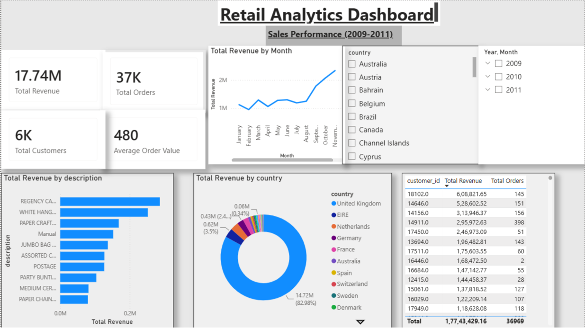

# Retail Analytics Dashboard

## Project Overview

This is an end-to-end Retail Analytics project built using MySQL, SQL, Power Query, DAX, and Power BI.

The project demonstrates the complete analytics workflow:

Raw Data
→ SQL Data Cleaning
→ Power Query Transformation
→ DAX Measures
→ Interactive Dashboard

---

## Tools Used

- MySQL
- SQL
- Power Query
- Power BI
- DAX

---

## KPIs

- Total Revenue
- Total Orders
- Total Customers
- Average Order Value

---

## Dashboard Insights

- Monthly Revenue Trend
- Revenue by Country
- Top Revenue Generating Products
- Customer-wise Revenue Analysis

---

## Files Included

- Retail_Analytics_Dashboard.pbix
- Retail_analytics_project_new.sql
- RAD.PNG

---

## Dashboard Preview

